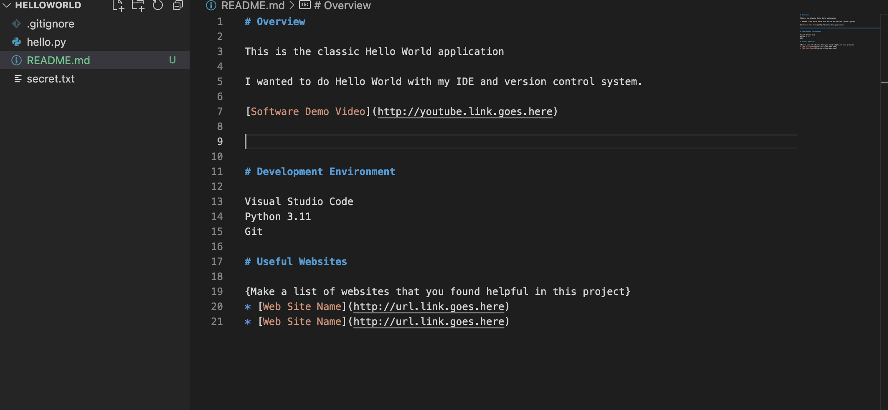

# Overview

This is the classic Hello World application

I wanted to do Hello World with my IDE and version control system.

[Software Demo Video](http://youtube.link.goes.here)

# Development Environment

Visual Studio Code
Python 3.11
Git

# Useful Websites

{Make a list of websites that you found helpful in this project}
* [Web Site Name](http://url.link.goes.here)
* [Web Site Name](http://url.link.goes.here)